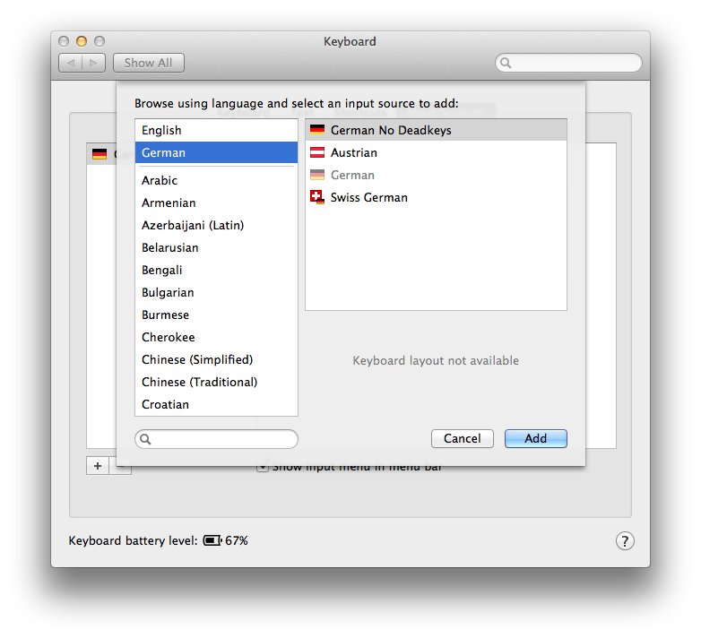
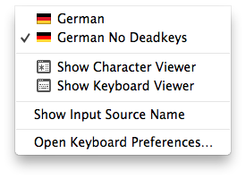

# A German OS X keyboard layout that eliminates deadkeys

## So I had a Vim problem and asked on Twitter...

I wanted to use the `~` key in Vim normal mode to toggle between uppercase and
lowercase spelling. But it would not toggle the letter, printing the `~` instead
on a yellow background. I asked @nelstrom on Twitter and @der_kronn explained to
me what was happening:

> @sebroeder OSX is assuming you want to combine letters and switching to
  diacritics mode. Try changing the keyboard-layout. [-- @der_kronn
on Twitter][tweet]

Unfortunatly OS X does not provide a "no deadkeys" variant of the German
keyboard layout, so I had to roll my own with [Ukulele.app][ukulele].

[tweet]: https://twitter.com/der_kronn/status/370974008248127488di
[ukulele]: http://scripts.sil.org/cms/scripts/page.php?site_id=nrsi&id=ukelele

## Installation

Copy the `German No Deadkeys.bundle` into `~/Library/Keyboard Layouts/` (or
`/Library/Keyboard Layouts/` if you want to make it accessable for all users on
your Mac).

Add the keyboard layout in `System Preferences --> Keyboard --> Input Sources`.
This might look a little different on your version of OS X. If the new layout
does not appear, you might need to logout and login again.

Now you can select the new layout from the Input menu in the menu bar.

## Usage

The `~`, `^`, `` ` `` and `´` keys should not be deadkeys anymore (waiting for a
second letter to compose diacritics) but function
immediately after the first key press.
